# IT Service Management (ITSM) Fundamentals

**Completed ServiceNow IT Service Management (ITSM) training focused on the core processes used to deliver and support enterprise IT services. Topics included Service Catalog, Request Management, Incident management, Problem Management, Change Management, Configuration Management, and Knowledge Management.**

 
 

## Key concepts:
* ITSM principles and service delivery lifecycle
* Service catalog request submission, approval, and fulfillment
* Incident creation, investigation, diagnosis, resolution, and closure
* Problem management workflows for root cause identification and remediation
* Change management processes including assessment, authorization, planning, and implementation
* Configuration and knowledge management practices that support IT operations

**Through hands-on exercises and simulations, gained familiarity with common IT service desk workflows, ticket lifecycle management, prioritization, escalation procedures, and operational best practices used in enterprise environments.**

---
 

# Walkthrough:

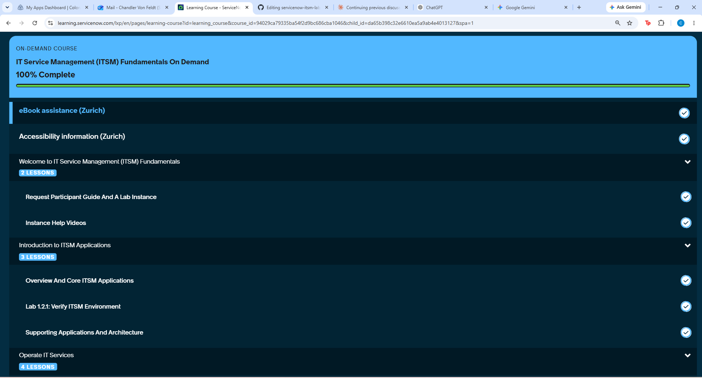
## 0. Welcome to ITSM Fundamentals
* **Focus:** Setup
* **Summary:** Started by getting oriented with the course, downloading participant guide, and provisioned my personal, hands-on lab instance.

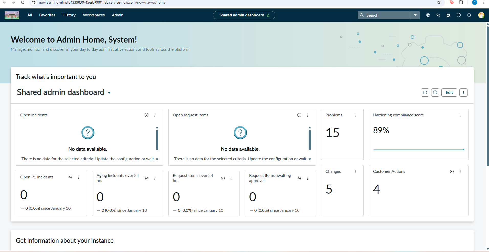

 

## 1. Introduction to ITSM Applications
* **Focus:** Architecture
* **Summary:** I explored the baseline architecture of ServiceNow's ITSM applications and completed **Lab 1.2.1** to log in and verify my environment was running correctly.
  
### Lab 1.2.1: Verify ITSM Environment
* I logged into my dedicated instance to validate the baseline infrastructure, configurations, and plugins required for the course (Service Catalog app, Incident management app, problem management app, and change management app)

---
 

## 2. Operate IT Services
* **Focus:** Request Management
* **Summary:** I worked with the Service Catalog to handle end-user requests. In **Lab 2.3.1 & Lab 2.3.2**, I practiced submitting catalog items, routing them through approval workflows, and tracking fulfillment tasks.

### Lab 2.3.1: Verify Service Catalog Request and approval
* I submitted a catalog item from the user perspective and routed it through the necessary manager approvals.

##### Submitted a Standard Laptop request (REQ0010001) through the Service Catalog application and confirmed order placement:
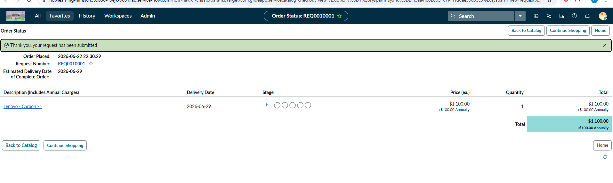
##### Submitted a request through the Employee Center portal to verify the alternate submission path:
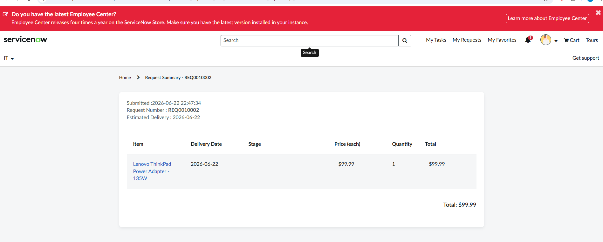
##### Verified automatic routing to approver Eric Schroeder and manually approved the request through the Approvers tab:
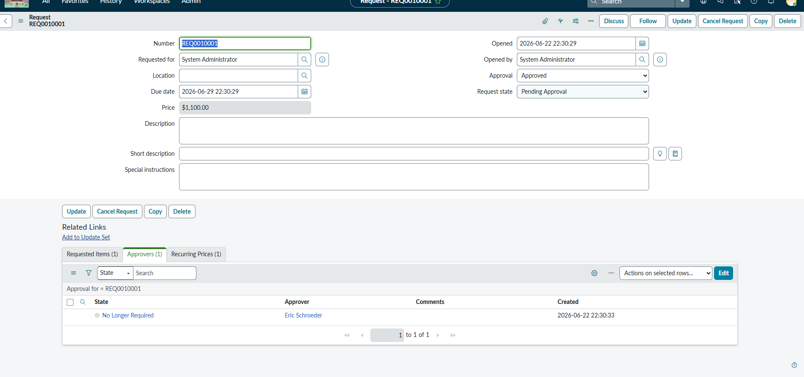
##### Confirmed Service Desk visibility of request details, approval status, and requested items through the Requested Items list view:
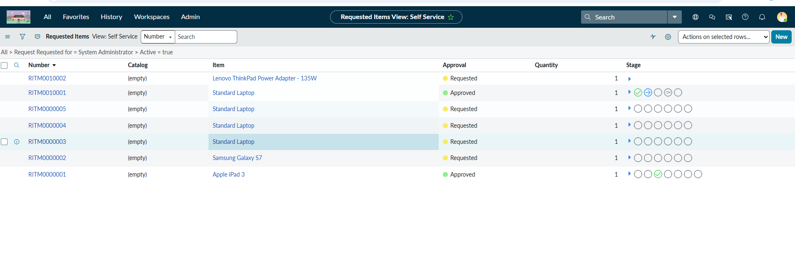

### Lab 2.3.2: Verify Request Fulfillment And Tracking
* Managed and updated the underlying fulfillment tasks to track the requested item all the way to completion.

##### Verified requested item RITM0010001 (Lenovo Carbon x1) is visible with approval status and item details, verified requested item task "Items ready to be fulfilled from stock" is present with a start date, and verified request state shows Stage: Order Fulfillment with Approval: Approved confirming the request progressed correctly:
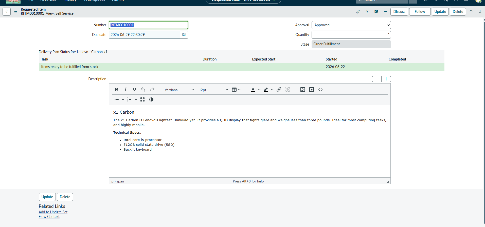

 

## 3. Maintain IT Services
* **Focus:** Incident & Problem Management
* **Summary:** I focused on fixing disruptions and finding their root causes. I managed the full lifecycle of logging, investigating, and resolving active incidents (**Labs 3.2.1 & 3.2.2**), adn handled tracking underlying problems to prevent future issues (**Labs 3.3.1 & 3.3.2**).

### Lab 3.2.1: Verify Incident Record Creation Capabilities
* I practiced logging and triaging a new incident to document an active service disruption.

##### Created incident record INC0010001 with a test description, confirming incident creation capability in the Incident Management application:

#####  Escalated INC0010001 by setting Impact and Urgency to 1 - High, automatically triggering Priority 1 - Critical to verify escalation routing:

### Lab 3.2.2: Verify Incident Tracking And Resolution Capabilities
* Investigated the disruption, applied a fix, and walked the incident through to formal resolution.

##### Verified incident record INC0010001 contained all expected fields including priority, impact, urgency, and assignment information:
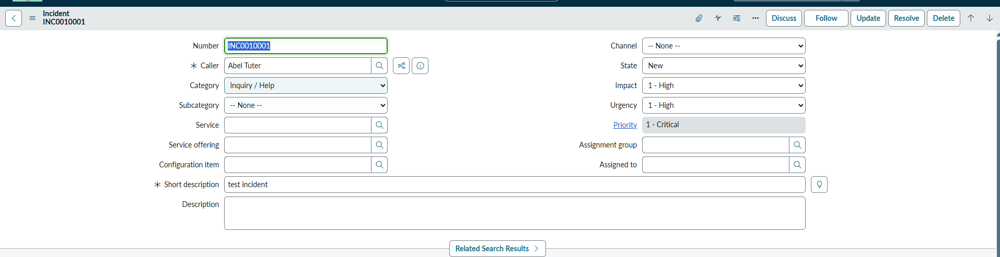
##### Verified related records were created and visible within the incident record:
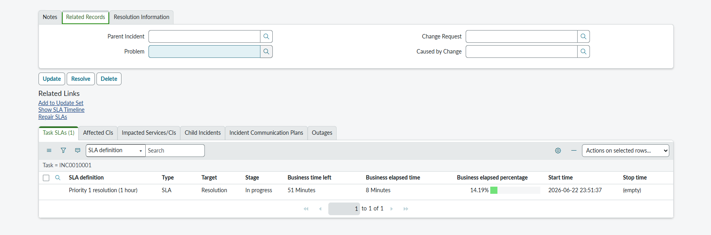
##### Resolved INC0010001 by updating the State to Resolved with resolution notes, confirming end-to-end incident lifecycle completion:

### Lab 3.3.1:Verify Problem Record Creation Capabilities
* Logged a problem record to investigate the underlying root cause behind recurring incidents.

##### Created problem record PRB0007601 and verified successful record creation in the Problem Management application:

##### Verified problem assessment capabilities by navigating through the Assess stage and reviewing impact, urgency, and priority fields:
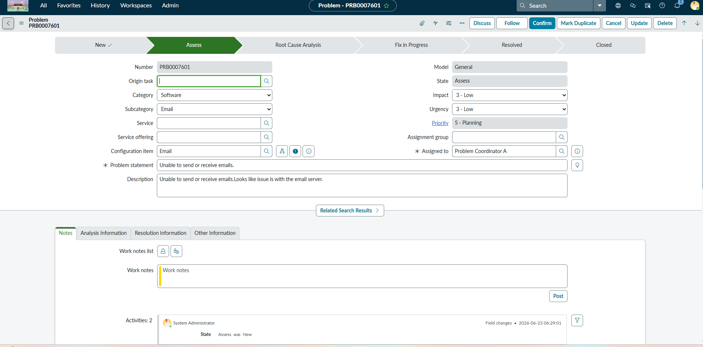

### Lab 3.3.2: Verify Problem Tracking And Resolution Capabilities
* Tracked the root-cause analysis, documented workarounds, and noted the permanent resolution to prevent future disruptions.

##### Verified problem diagnosis capabilities by entering cause notes identifying email server misconfiguration as root cause in the Analysis Information tab:
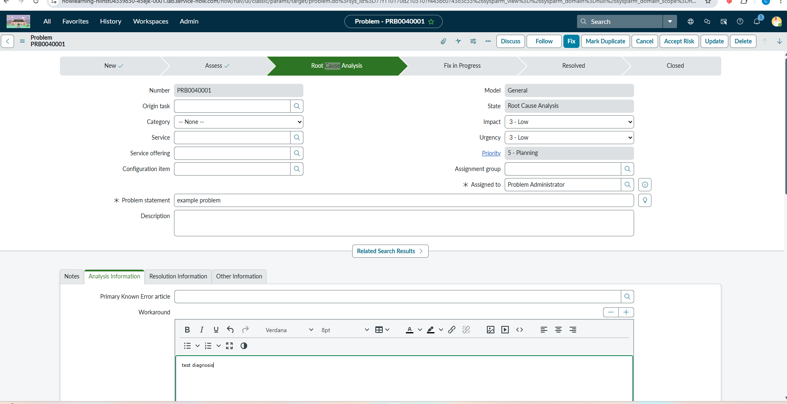
##### Verified problem solution and closure by entering fix notes and advancing the problem record to Resolved state:
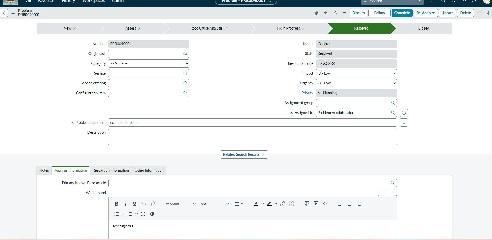

---
 

## 4. Improve IT Services
* **Focus:** Change Management
* **Summary:** I learned how to push IT infrastructure updates safely while minimizing risk. In **Labs 4.2.1 and 4.2.2**, I created change requests, routed them through necessary approvals, and trcaked them through execution to formal closure.

### Lab 4.2.1: Verify Change creation And Authorization Capabilities
* created a structured change request and routed it through the necessary risk assessments and authorization gates.

##### Created change request CHG0030001 with scheduling and planning details, verifying change request creation and scheduling capabilities:

##### Added a CI to the Affected CIs tab and completed risk and impact analysis fields to verify risk assessment and CI update capabilities:

##### Verified automatic routing to CAB approvers and manually approved all approvals to authorize the change request:

### Lab 4.2.2: Verify Change Request Tracking And Closure Capabilities
* Monitored the implementation of the change in the system and successfully closed it out after validating its success.

##### Created change task CTASK0010001 linked to CHG0030001, verifying change task creation and association capabilities:

##### Advanced CHG0030001 through all states from Assess to Closed, verifying full change request completion and closure lifecycle:

 

## 5. Summary and Recap
* **Focus:** Platform Synthesis
* **Summary:** I wrapped up the course by connecting the dots between all four lifecycles, reviewing how requests, incidents, problems, and changes seamlessly share data and interact across the ServiceNow platform.
